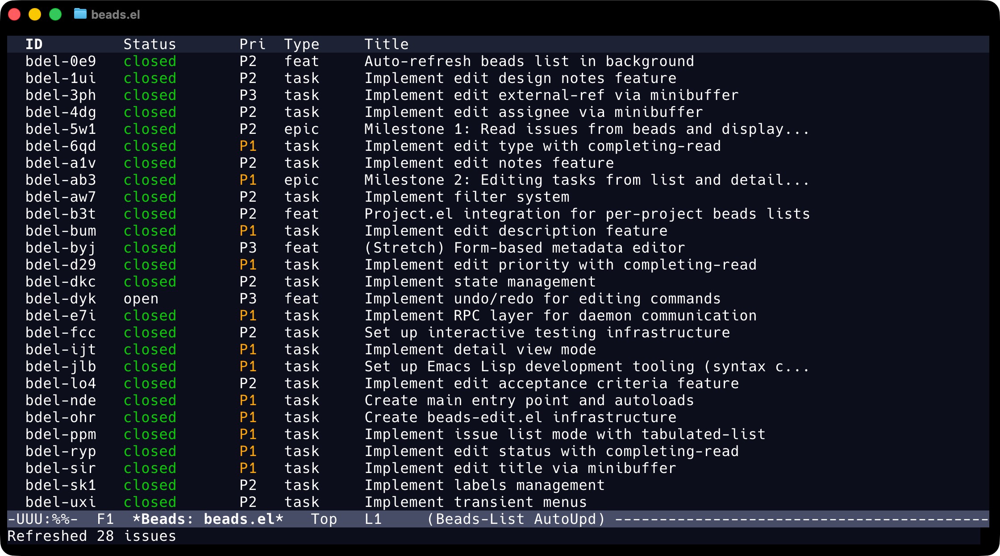
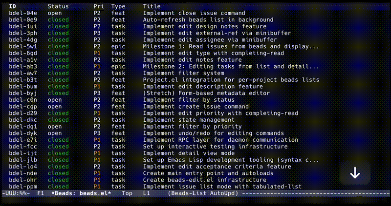
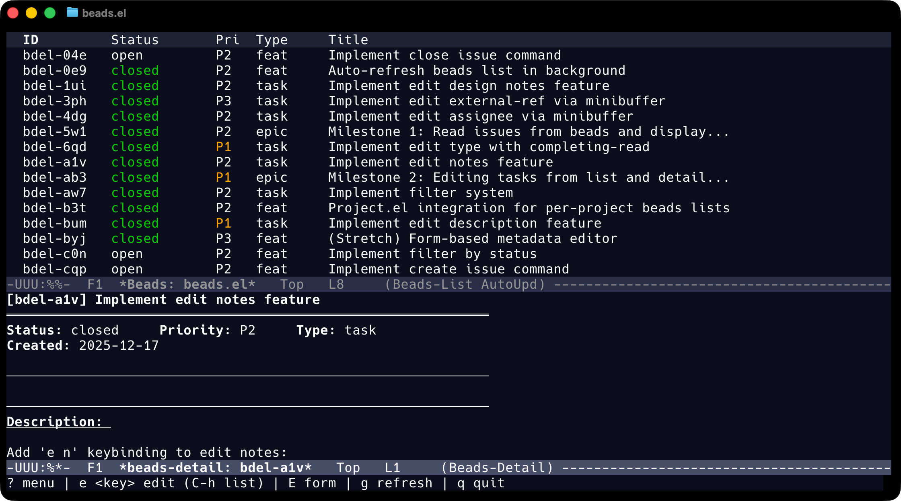
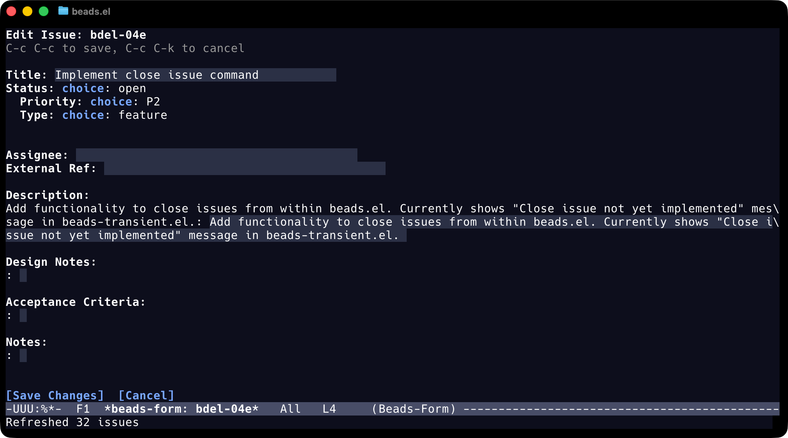

# beads.el - Emacs Client for Beads Issue Tracker

[](https://codeberg.org/ctietze/beads.el)

## Overview

beads.el provides an Emacs interface to the [Beads](https://github.com/steveyegge/beads) issue tracking system.
Beads is a lightweight, Git-backed issue tracker that stores data locally in
`.beads/` alongside your code. It works well with AI coding assistants but
doesn't require them—you can use it entirely from Emacs or the command line.

## Screenshots

*(Screenshots use [modus-themes](https://protesilaos.com/emacs/modus-themes))*

### Issue List

Browse issues in a sortable, filterable table. Press `P` to toggle preview mode.



### Preview Mode

Navigate issues with live preview in a side window:



([View full quality video](screenshots/beads-preview-mode-demo.mp4))

### Issue Details

View full issue details including description, design notes, and metadata:



### Editing

Edit long-form fields (description, design, notes) in dedicated buffers with
`markdown-mode` support:


Or use the form editor (`E`) to edit all fields at once:



## Installation

### From MELPA (Recommended)

Once available on MELPA:

```elisp
(use-package beads
  :ensure t)
```

Or with `package.el`:

```elisp
(package-install 'beads)
```

### From Git (Emacs 30+)

With the built-in `:vc` keyword:

```elisp
(use-package beads
  :vc (:url "https://codeberg.org/ctietze/beads.el" :lisp-dir "lisp" :rev :newest))
```

### Manual Installation

```elisp
(add-to-list 'load-path "/path/to/beads.el/lisp")
(require 'beads)
```

### With straight.el

```elisp
(straight-use-package
 '(beads :type git :host github :repo "ChristianTietze/beads.el"
         :files ("lisp/*.el")))
```

## Usage

- `M-x beads` or `M-x beads-list` - Open the issue list
- `M-x beads-project-list` - Open issue list for current project
- `M-x beads-activity` - Open the activity feed
- `M-x beads-stale` - Show stale issues (not updated recently)
- `M-x beads-orphans` - Show orphaned issues (referenced in commits but not closed)
- `M-x beads-duplicates` - Find and merge duplicate issues
- `M-x beads-conflicts` - View and resolve JSONL merge conflicts
- `M-x beads-lint` - Show issues missing required template sections
- `M-x beads-create-issue-preview` - Create issue with preview

## Keybindings

### List Mode (`beads-list-mode`)

| Key | Command | Description |
|-----|---------|-------------|
| `RET` | `beads-list-goto-issue` | Open issue in detail view |
| `E` | `beads-list-edit-form` | Open form editor for issue |
| `e t` | `beads-list-edit-title` | Edit title |
| `e s` | `beads-list-edit-status` | Edit status |
| `e p` | `beads-list-edit-priority` | Edit priority |
| `e T` | `beads-list-edit-type` | Edit type |
| `e d` | `beads-list-edit-description` | Edit description |
| `a` | `beads-list-quick-assign` | Assign issue (with completion) |
| `A` | `beads-list-assign-to-me` | Assign issue to self |
| `/` | `beads-search` | Search issues by title/description |
| `f` | `beads-filter-menu` | Open filter menu |
| `f s` | `beads-filter-status` | Filter by status |
| `f p` | `beads-filter-priority` | Filter by priority |
| `f t` | `beads-filter-type` | Filter by type |
| `f a` | `beads-filter-assignee` | Filter by assignee |
| `f l` | `beads-filter-label` | Filter by label |
| `f r` | `beads-filter-ready-issues` | Show ready issues only |
| `f b` | `beads-filter-blocked-issues` | Show blocked issues only |
| `f c` | `beads-filter-clear` | Clear all filters |
| `s` | `beads-list-toggle-sort-mode` | Toggle sectioned/column sort |
| `o` | `beads-list-cycle-sort` | Cycle through sort columns |
| `O` | `beads-list-reverse-sort` | Reverse sort direction |
| `H` | `beads-hierarchy-show` | Show dependency tree |
| `P` | `beads-preview-mode` | Toggle preview mode |
| `S` | `beads-stats` | Show project statistics |
| `D` | `beads-delete-issue` | Delete issue (with confirmation) |
| `R` | `beads-reopen-issue` | Reopen closed issue |
| `g` | `beads-list-refresh` | Refresh issue list |
| `M-n` | `beads-list-next-section` | Jump to next section |
| `M-p` | `beads-list-previous-section` | Jump to previous section |
| `?` | `beads-menu` | Show transient menu |
| `q` | `beads-list-quit` | Quit |

### Detail Mode (`beads-detail-mode`)

| Key | Command | Description |
|-----|---------|-------------|
| `E` | `beads-detail-edit-form` | Open form editor |
| `e d` | `beads-detail-edit-description` | Edit description |
| `e D` | `beads-detail-edit-design` | Edit design notes |
| `e a` | `beads-detail-edit-acceptance` | Edit acceptance criteria |
| `e n` | `beads-detail-edit-notes` | Edit notes |
| `e t` | `beads-detail-edit-title` | Edit title |
| `e s` | `beads-detail-edit-status` | Edit status |
| `e p` | `beads-detail-edit-priority` | Edit priority |
| `e T` | `beads-detail-edit-type` | Edit type |
| `e A` | `beads-detail-edit-assignee` | Edit assignee |
| `e x` | `beads-detail-edit-external-ref` | Edit external reference |
| `e l a` | `beads-detail-edit-label-add` | Add label |
| `e l r` | `beads-detail-edit-label-remove` | Remove label |
| `c` | `beads-detail-add-comment` | Add comment |
| `H` | `beads-hierarchy-show` | Show dependency tree |
| `P` | `beads-detail-goto-parent` | Navigate to parent issue |
| `C` | `beads-detail-view-children` | View children in filtered list |
| `D` | `beads-delete-issue` | Delete issue (with confirmation) |
| `R` | `beads-reopen-issue` | Reopen closed issue |
| `g` | `beads-detail-refresh` | Refresh detail view |
| `M-n` | `beads-detail-next-section` | Jump to next section |
| `M-p` | `beads-detail-previous-section` | Jump to previous section |
| `?` | `beads-menu` | Show transient menu |
| `q` | `quit-window` | Quit |

### Form Editor (`beads-form-mode`)

| Key | Command | Description |
|-----|---------|-------------|
| `TAB` | `widget-forward` | Next field |
| `S-TAB` | `widget-backward` | Previous field |
| `C-c C-c` | `beads-form-commit` | Save all changes |
| `C-c C-k` | `beads-form-cancel` | Discard and close |

### Edit Buffer (`beads-edit-mode`)

| Key | Command | Description |
|-----|---------|-------------|
| `C-c C-c` | `beads-edit-commit` | Save changes |
| `C-c C-k` | `beads-edit-abort` | Discard changes |

### Create Preview (`beads-create-preview-mode`)

Preview an issue before creating it. Shows what the issue will look like,
then confirm to actually create it.

| Key | Command | Description |
|-----|---------|-------------|
| `C-c C-c` | `beads-create-preview-confirm` | Create the issue |
| `C-c C-k` | `beads-create-preview-cancel` | Cancel without creating |
| `q` | `beads-create-preview-cancel` | Cancel without creating |

### Activity Feed (`beads-activity-mode`)

<!-- TODO: Add screenshot for activity feed (see bdel-4hp) -->

The activity feed shows real-time issue mutations (creates, updates, deletes, comments).

| Key | Command | Description |
|-----|---------|-------------|
| `RET` | `beads-activity-goto-issue` | Open issue in detail view |
| `f` | `beads-activity-toggle-follow` | Toggle live updates (polling) |
| `F` | `beads-activity-set-filter` | Filter by prefix or event type |
| `g` | `beads-activity-refresh` | Refresh feed |
| `l` | `beads-activity-set-limit` | Set number of events to show |
| `q` | `beads-activity-quit` | Quit (stops follow mode) |

### Stale Issues (`beads-stale-mode`)

<!-- TODO: Add screenshot for stale issues view (see bdel-4hp) -->

Shows issues not updated within a configurable number of days.

| Key | Command | Description |
|-----|---------|-------------|
| `RET` | `beads-stale-goto-issue` | Open issue in detail view |
| `c` | `beads-stale-claim` | Claim issue (set to in_progress) |
| `d` | `beads-stale-set-days` | Change days threshold |
| `f` | `beads-stale-set-filter` | Filter by status |
| `g` | `beads-stale-refresh` | Refresh list |
| `q` | `quit-window` | Quit |

### Orphaned Issues (`beads-orphans-mode`)

<!-- TODO: Add screenshot for orphans view (see bdel-4hp) -->

Shows issues referenced in git commits but not marked as closed.

| Key | Command | Description |
|-----|---------|-------------|
| `RET` | `beads-orphans-goto-issue` | Open issue in detail view |
| `c` | `beads-orphans-close` | Close orphan with reason |
| `g` | `beads-orphans-refresh` | Refresh list |
| `q` | `quit-window` | Quit |

### Duplicate Issues (`beads-duplicates-mode`)

<!-- TODO: Add screenshot for duplicates view (see bdel-4hp) -->

Find issues with identical content and merge them. Issues are grouped by content
hash. Each group shows a suggested merge target (the issue with most references)
and sources (duplicates to be closed).

| Key | Command | Description |
|-----|---------|-------------|
| `RET` | `beads-duplicates-goto-issue` | Open issue in detail view |
| `m` | `beads-duplicates-merge-at-point` | Merge issue at point into target |
| `M` | `beads-duplicates-merge-group` | Merge all sources in group |
| `g` | `beads-duplicates-refresh` | Refresh list |
| `q` | `quit-window` | Quit |

### Merge Conflicts (`beads-conflicts-mode`)

View and resolve JSONL merge conflict markers. When git merges fail to
auto-resolve, JSONL files can have conflict markers. This mode detects
such conflicts and resolves them using beads' mechanical merge rules.

| Key | Command | Description |
|-----|---------|-------------|
| `r` | `beads-conflicts-resolve-all` | Resolve all conflicts |
| `g` | `beads-conflicts-refresh` | Refresh conflict status |
| `q` | `quit-window` | Quit |

### Hierarchy View (`beads-hierarchy-mode`)

Show the full dependency tree for any issue, with ancestors above and descendants below.
Press `H` from the list or detail view to open.

| Key | Command | Description |
|-----|---------|-------------|
| `RET` | `beads-hierarchy-goto-issue` | Open issue in detail view |
| `TAB` | `beads-hierarchy-next` | Move to next issue |
| `S-TAB` | `beads-hierarchy-previous` | Move to previous issue |
| `g` | `beads-hierarchy-refresh` | Refresh tree |
| `q` | `quit-window` | Quit |

### Issue Lint Report (`beads-lint-mode`)

<!-- TODO: Add screenshot for lint report (see bdel-4hp) -->

Check issues for missing recommended template sections based on issue type.
Bugs need Steps to Reproduce and Acceptance Criteria, tasks/features need
Acceptance Criteria, epics need Success Criteria.

| Key | Command | Description |
|-----|---------|-------------|
| `RET` | `beads-lint-goto-issue` | Open issue in detail view |
| `f` | `beads-lint-filter-type` | Filter by issue type |
| `n` | `beads-lint-next-issue` | Move to next issue |
| `p` | `beads-lint-prev-issue` | Move to previous issue |
| `g` | `beads-lint-refresh` | Refresh report |
| `q` | `quit-window` | Quit |

## Customization

### General

```elisp
;; Disable keybinding hints in minibuffer
(setq beads-verbose nil)
```

### Auto-Refresh (`beads-autoupdate`)

```elisp
;; Disable auto-refresh entirely
(setq beads-autoupdate-enable nil)

;; Change refresh interval (default: 30 seconds)
(setq beads-autoupdate-interval 60)

;; Disable auto-refresh per-project via .dir-locals.el:
((beads-list-mode . ((beads-autoupdate-message . nil))))
```

| Variable | Default | Description |
|----------|---------|-------------|
| `beads-autoupdate-enable` | `t` | Enable auto-refresh in list mode |
| `beads-autoupdate-interval` | `30` | Seconds between refreshes (nil=disabled) |
| `beads-autoupdate-message` | `t` | Show message on auto-refresh (dir-local) |

### Project Integration (`beads-project`)

```elisp
;; Disable per-project buffers (use single global buffer)
(setq beads-project-per-project-buffers nil)

;; Disable adding to project-switch-commands
(setq beads-project-add-switch-command nil)

;; Custom buffer name function
(setq beads-project-buffer-name-function
      (lambda (root)
        (format "*Issues: %s*" (beads-project-name root))))
```

| Variable | Default | Description |
|----------|---------|-------------|
| `beads-project-per-project-buffers` | `t` | Create separate buffer per project |
| `beads-project-add-switch-command` | `t` | Add to project-switch-commands |
| `beads-project-buffer-name-function` | `beads-project-default-buffer-name` | Function to generate buffer name |

### Activity Feed (`beads-activity`)

```elisp
;; Change default number of events shown
(setq beads-activity-limit 100)

;; Change polling interval for follow mode (seconds)
(setq beads-activity-poll-interval 10)

;; Use ASCII-only glyphs (for terminals without Unicode)
(setq beads-activity-glyphs beads-activity-glyphs-ascii)

;; Customize individual glyphs
(setq beads-activity-glyphs
      '((create . "+")
        (update . "→")
        (status-in_progress . "▶")
        (status-closed . "✓")
        (status-blocked . "✗")
        (status-open . "○")
        (delete . "⊘")
        (comment . "#")))
```

| Variable | Default | Description |
|----------|---------|-------------|
| `beads-activity-limit` | `50` | Default number of events to show |
| `beads-activity-poll-interval` | `5` | Seconds between polls in follow mode |
| `beads-activity-glyphs` | Unicode alist | Event type → glyph mapping |
| `beads-activity-glyphs-ascii` | ASCII alist | Alternative ASCII-only glyphs |

### Stale Issues (`beads-stale`)

```elisp
;; Change staleness threshold (default: 30 days)
(setq beads-stale-days 14)

;; Default to showing only in_progress issues
(setq beads-stale-status "in_progress")
```

| Variable | Default | Description |
|----------|---------|-------------|
| `beads-stale-days` | `30` | Days without update before issue is stale |
| `beads-stale-status` | `nil` | Filter by status (nil = all statuses) |

### Issue Type Display (`beads-faces`)

```elisp
;; Use 4-character abbreviations (feat, task, epic, chor, conv, agnt)
(setq beads-type-style 'short)

;; Show glyphs for special types (gate ■, convoy ▶, agent ◉, role ●, rig ⚙)
(setq beads-type-glyph t)
```

| Variable | Default | Description |
|----------|---------|-------------|
| `beads-type-style` | `'full` | `'full` for full names, `'short` for 4-char |
| `beads-type-glyph` | `nil` | Show unicode glyphs for special types |

### P0 Priority Highlighting

```elisp
;; Disable whole-row highlighting for P0 issues
(setq beads-list-highlight-p0-rows nil)

;; Customize the P0 row background color
(set-face-attribute 'beads-list-row-p0 nil :background "#ff0000")
```

| Variable | Default | Description |
|----------|---------|-------------|
| `beads-list-highlight-p0-rows` | `t` | Highlight entire row for P0 issues |

### Detail View Rendering (`beads-detail`)

When `markdown-mode` is installed, the detail view renders descriptions, design
notes, acceptance criteria, and comments with markdown syntax highlighting.

```elisp
;; Disable markdown rendering in detail view
(setq beads-detail-render-markdown nil)

;; Disable vui.el and use traditional text rendering
(setq beads-detail-use-vui nil)
```

| Variable | Default | Description |
|----------|---------|-------------|
| `beads-detail-render-markdown` | `t` | Enable markdown syntax highlighting |
| `beads-detail-use-vui` | `t` | Use vui.el declarative components |
| `beads-detail-vui-editable` | `t` | Show inline edit buttons in vui mode |
| `beads-detail-section-style` | `'heading` | `'heading` (compact) or `'separator` (with rules) |

### Form Editor (`beads-form`)

```elisp
;; Disable vui.el and use traditional widget.el forms
(setq beads-form-use-vui nil)
```

| Variable | Default | Description |
|----------|---------|-------------|
| `beads-form-use-vui` | `t` | Use vui.el declarative components |

## Requirements

- Emacs 28.1+
- [Beads](https://github.com/steveyegge/beads) CLI: `bd` 0.49.1+ (recommended) or `br` (beads_rust)
- `hierarchy` package (for dependency tree view)
- `transient` package (for menus)
- `vui` package (for declarative UI components)
- `markdown-mode` (optional, for editing long text fields)

### CLI Backends

beads.el supports two CLI backends:

- **`bd`** (default) — Full-featured. Supports daemon mode for fast
  communication via socket, with CLI fallback. Start the daemon with `bd daemon`.
- **`br`** (beads_rust) — CLI-only, no daemon support. Reduced operation set
  (no activity feed, comments, or reopen). Useful if you only have `br` installed.

Auto-detection tries `bd` first, then `br`. Override per-project via
`.dir-locals.el`:

```elisp
((nil . ((beads-cli-program . "br"))))
```

Or globally:

```elisp
(setq beads-cli-program "br")
```

## Development

This project uses [Beads](https://github.com/steveyegge/beads) itself for issue tracking.
You can check out the repository and view the project's issues:

```bash
# Start the daemon
bd daemon

# Launch Emacs with beads.el loaded
mise run interactive
```

Then run `M-x beads-list` to see the beads.el development issues.
